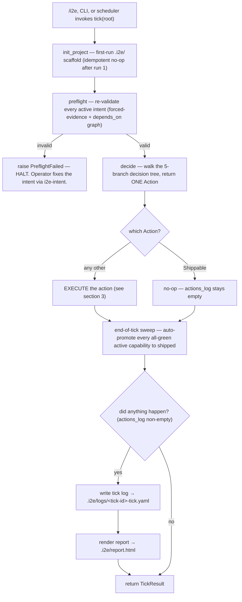
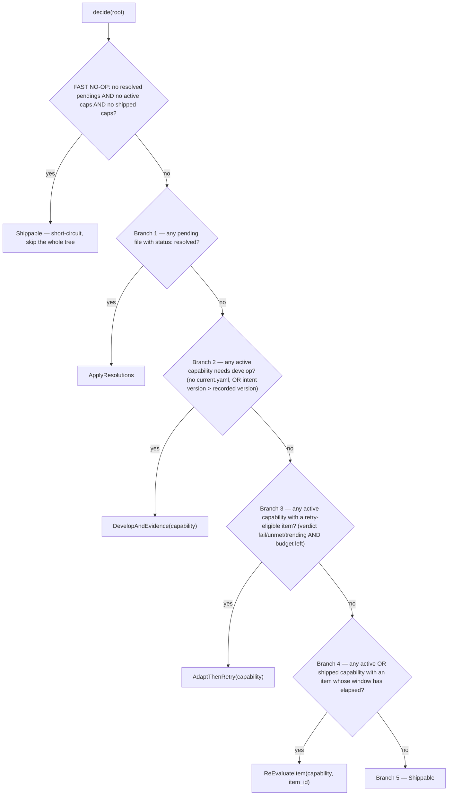
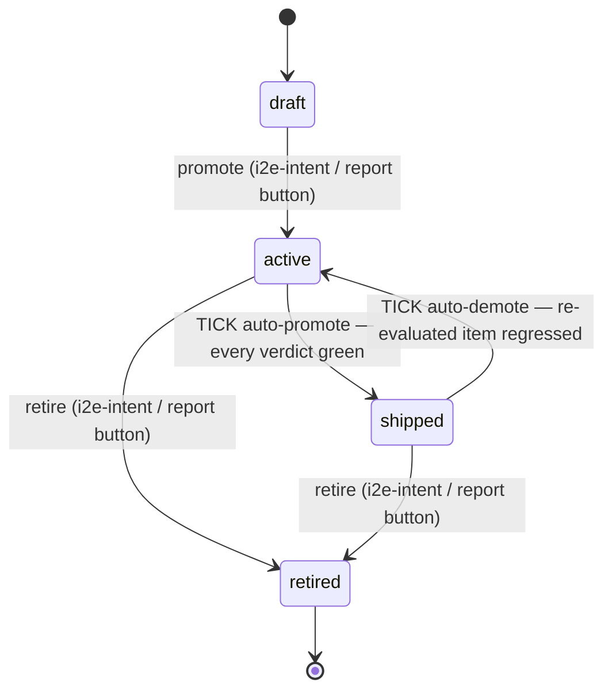

# Anatomy of a Tick — what one orchestrator tick can actually do

A **tick** is one call to `i2e_core.orchestrator.tick()`. It is the
single-step primitive: the CLI (`python -m i2e_core.orchestrator`) and any
scheduler run exactly one. The `/i2e` skill wraps `tick()` in a loop and
keeps calling it until the project is `Shippable`.

This document answers one question precisely: **given the project's state,
what is a single tick capable of doing?**

> Source of truth: `src/i2e_core/orchestrator.py` (`tick`, `decide`) and
> `src/i2e_core/adapt.py`. If this diagram and the code disagree, the code
> wins — fix this file.

---

## 1. The tick lifecycle

Every tick runs the same five-stage pipeline. Only **stage 3 (execute)**
varies — and what it does is fixed by which branch `decide()` picked.

Key facts:

- **One tick executes exactly one branch / one `Action`.** Driving the
  project to steady state takes many ticks — that loop lives in the `/i2e`
  skill, not in `tick()`.
- A **no-op tick** (`Shippable`) writes nothing: no log, no report.
- `init_project` and `preflight` run *every* tick, before the decision.
- A failed preflight **halts** — the tick raises and does nothing else.

---

## 2. The decision — `decide()` picks one of five outcomes

`decide()` walks the branches **in strict order** and returns the **first**
that matches. Branch 1 always beats branch 2, etc.

Notes that bite:

- **Shipped capabilities** are skipped by branches 1–3 but **still seen by
  branch 4** — a stale target on a shipped capability can pull it back.
- **Draft and retired** capabilities are invisible to every branch.
- Capabilities locked by another live `i2e` instance are skipped in
  branches 2–4 (concurrent ticks swarm disjoint work).
- The fast no-op short-circuit fires only when there are **zero**
  capabilities of any live status *and* no resolved pendings.

---

## 3. What each branch actually executes

| Action | Fires when | What the tick does | Writes to |
|---|---|---|---|
| **ApplyResolutions** | A `.i2e/pending/` file has `status: resolved` | `adapt.apply_resolutions()` parses each resolution and applies it: **loosen** (edit item `expect`, bump intent version), **new approach** (reset `attempts_used` in `current.yaml`), **retire** (drop the item, bump version), **accept** (force verdict to `met`/`pass`), or **human eval** (write the yes/no/partial verdict). Each applied pending is archived. | `.i2e/intents/**`, `.i2e/evidence/**` (current.yaml), `.i2e/logs/**` |
| **DevelopAndEvidence** | An active capability has no `current.yaml`, or its intent `version` is ahead of the recorded one | Claims a worktree lock → **`i2e-develop`** writes code in `src/` + `tests/` → `evidence_runner.run()` invokes every provider and records verdicts → if all verdicts green, **auto-promote** the capability to `shipped` and release the lock | `src/**`, `tests/**`, `.i2e/evidence/**`, `.i2e/intents/**` (status only), `.i2e/worktrees/**` |
| **AdaptThenRetry** | An active capability has an item with verdict `fail`/`unmet`/`trending` **and** retry budget remaining | `adapt.plan()` buckets non-passing items into *retries* vs *escalations*. Budget-exhausted items get an **escalation pending file** written for a human. (The retry itself is a develop+evidence cycle picked up on a later tick.) | `.i2e/pending/**` |
| **ReEvaluateItem** | An active **or shipped** capability has one item whose `window:` has elapsed since `last_observed` | `evidence_runner.run()` re-runs **just that one item's** provider and records the new verdict → if a shipped capability's item regressed to `fail`/`unmet`/`trending`, **auto-demote** it back to `active` | `.i2e/evidence/**`, `.i2e/intents/**` (status only) |
| **Shippable** | Nothing above matched — every capability is green | Nothing. No log, no report. | — (nothing) |

> The pure-Python `tick()` records `ran_develop` as an action string but
> does **not** itself write code — the actual `i2e-develop` step is
> LLM-driven and invoked by the `/i2e` skill between ticks. `tick()` always
> runs the evidence half directly.

---

## 4. Status transitions a tick can trigger

Two — and only two — status edits are owned by the orchestrator. Every
other status change flows through `i2e-intent`.

- **Auto-promote** (`active → shipped`) happens two ways in a tick: at the
  end of the `DevelopAndEvidence` branch, and again in the end-of-tick
  sweep that scans *every* active capability — so a capability that went
  green as a side effect still ships the same tick.
- **Auto-demote** (`shipped → active`) happens only inside the
  `ReEvaluateItem` branch when the fresh verdict is `fail`/`unmet`/`trending`.

---

## 5. What a tick **cannot** do

Just as important as the capabilities:

- **It cannot re-run an `awaiting_human` item.** That verdict is "done" to
  `adapt.plan()` and invisible to branch 4. The item moves only when a
  human resolves its pending file — then **branch 1** applies it. Ticking
  forever will not budge it.
- **It cannot run a target before its `window:` elapses.** Branch 4 is
  wall-clock gated. A `7d`-window target sees ~7 days of no-op ticks
  before one tick re-evaluates it.
- **It cannot touch a draft or retired capability** — both are skipped by
  preflight and by every `decide()` branch.
- **It cannot run more than one branch.** One tick = one `Action`.
- **It cannot collect a target's first observation via branch 4.** The
  first verdict for any item comes from branch 2 (or a branch 3 retry);
  branch 4 only re-evaluates items that already have a verdict.
- **It writes nothing on a `Shippable` tick** — no tick log, no report
  re-render.

---

## 6. One-line summary

> A tick = `init` + `preflight` + **one** of {apply a human's resolution,
> develop+evidence a capability, escalate exhausted items, re-evaluate one
> stale item, do nothing} + an all-green promotion sweep + (if anything
> happened) a log entry and a report re-render.
